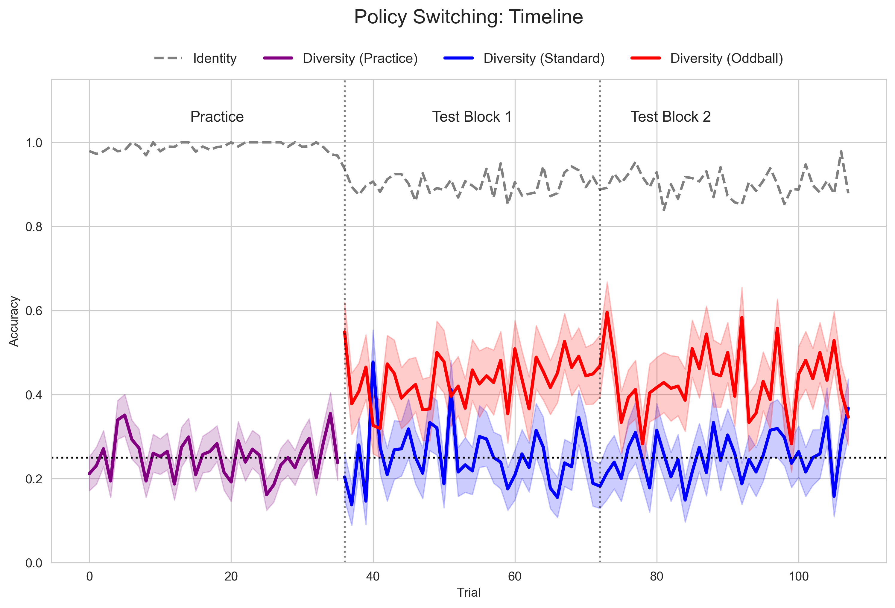
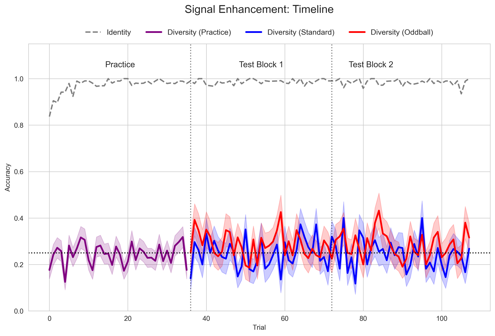

# RL Policy Switching and Thalamic Gating Simulation

This repository contains the simulation framework and analysis scripts for modeling **Prediction Error and Thalamic Gating**.

The project simulates how **Prediction Error (PE)** modulates attention to break "blocking" effects in human reasoning. Crucially, it models this process as a **Circuit Breaker** mechanism: PE momentarily disengages the dominant "Identity" policy to allow latent "Diversity" rules to be expressed, even when learning is frozen.

 
*Figure 1: The experimental trial sequence generating the exogenous Prediction Error.*

## 🧠 Core Theoretical Framework

We formalize two competing computational hypotheses to explain the "Unblocking" effect. 

*Figure 2: The proposed Thalamic Gating mechanism disrupting the filtered state.*

### Model A: The Signal Enhancement Model (Input Gating)
* **Hypothesis:** Blocking occurs because the neural signal for "Diversity" features is too noisy or suppressed. PE reduces this noise (Thalamic Disinhibition).
* **Mechanism:** A single RL agent where the Metacontroller acts as a **Volume Knob** on the input features.
* **Logic:** $Input_{diversity} = Input_{raw} \times \text{Sigmoid}(PE)$.

### Model B: The Policy Switching Model (Dual Policy)
* **Hypothesis:** Blocking occurs because the brain defaults to a cheap "Greedy" heuristic (Identity). PE triggers a switch to a computationally expensive "Relational" policy (Diversity).
* **Mechanism:** An arbitration between two distinct policies. The Metacontroller acts as a **Railway Switch**.
* **Logic:**
    $$\pi_{final}(a|s) = (1-\beta) \cdot \pi_{greedy}(a|s) + \beta \cdot \pi_{attn}(a|s)$$
    $$\beta = \text{Sigmoid}(\text{Gain} \cdot PE - \text{Threshold})$$

## ⚙️ Model Parameters

To capture the nuance of behavior (blocking strength, forgetting, graded gating), the architecture uses a 6-parameter cognitive model.

### 1. Core Learning (The Agent)
* `alpha` ($\alpha$): Learning Rate ($0 < \alpha < 1$). Controls update speed during Practice.
* `phi` ($\phi$): Decay/Forgetting Rate ($0 < \phi < 1$). Decay of unchosen feature weights.

### 2. Decision Making (The Action)
* `beta_softmax` ($\beta$): Inverse Temperature. Controls the exploration-exploitation balance.

### 3. Thalamic Gating (The Metacontroller)
Modeled using a sigmoidal gating curve:
$$Gate(t) = \epsilon + \frac{1-\epsilon}{1 + e^{-k(PE_t - \theta)}}$$

* `epsilon` ($\epsilon$): **Baseline Attention** (Leak/Noise floor).
* `k`: **Gating Sensitivity** (Slope of the Sigmoid).
* `theta` ($\theta$): **Gating Threshold** (PE required to open the gate).

## 🔬 Simulation Structure (3-Phase Design)

The simulation runs autonomous "Digital Twins" through a 3-phase environment:

1.  **Phase 1: Practice (Learning Enabled)**
    * **Trials:** 36 (18 Identity / 18 Diversity).
    * **Feedback:** Yes (Binary Reward +/- 1).
    * **Mechanism:** Agent learns weights ($w_{id}$, $w_{div}$). Due to blocking, $w_{id}$ grows large while $w_{div}$ remains low.
2.  **Phase 2: Block 1 (Early Test)**
    * **Trials:** 36 (18 Identity / 18 Diversity).
    * **Feedback:** **NO**. (Learning is Frozen).
    * **Mechanism:** Agent exploits frozen weights. In the PE Group, the Oddball signal opens the gate, bypassing the decayed weights to win the competition (Unblocking).
3.  **Phase 3: Block 2 (Late Test)**
    * **Trials:** 36 (18 Identity / 18 Diversity).
    * **Feedback:** **NO**. (Learning is Frozen).
    * **Mechanism:** Identical to Block 1. Used to observe washout effects.

## 📊 Simulation Results

As shown below, the **Policy Switching** model successfully reproduces the transient unblocking effect during Oddball (PE) trials. 

*Figure 3: Simulated trial-by-trial timeline for the Policy Switching architecture. The diversity policy successfully intervenes during Test Block 1.*

In contrast, the **Signal Enhancement** model remains mathematically bottlenecked and heavily suppressed by the dominant prior.

*Figure 4: Simulated trial-by-trial timeline for the Signal Enhancement architecture. The agent remains blocked.*

## 📂 Repository Status: Preprint

**Notice:** To protect unpublished empirical data and proprietary cognitive architectures prior to peer review, the core execution files (`agent.py`, `metacontroller.py`, `main.py`) and human behavioral datasets are currently withheld. 

This repository currently provides the analysis, plotting, and environmental generation utilities used to evaluate the simulations. The complete source code and datasets will be released upon publication.

### Available Scripts
* `env.py`: Generates the multi-dimensional odd-one-out task structures.
* `analysis.py`: Generates learning curves and performance bar plots.
* `compare_models.py`: Executes AIC/BIC model selection and plots internal decision dynamics.
* `parameter_range_check_plot.py`: Visualizes fitted parameter distributions.
* `supplementary_plot.py`: Generates parameter and model recovery matrices.